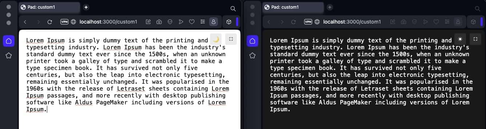

# micro-pad

A minimalist real-time collaborative notepad with built-in dark mode.



## Features
- Real-time collaboration: Multiple users can edit the same pad simultaneously
- Instant sync across all connected clients
- Dark mode toggle
- Fullscreen mode
- Minimalist interface: Just write!
- Random pad ID generation if none provided
- No database required, everything runs in memory

## Installation

```bash
npm install -g micro-pad
```

## Usage

### Start the server
```bash
micro-pad
```

Server will start on port 3000 by default.

### Access a pad

- Open http://localhost:3000 - redirects to a random pad
- Or directly access a specific pad: http://localhost:3000/my-custom-pad-name

## Docker

You can run micro-pad using Docker Compose:

```yaml
version: '3'

services:
  pad:
    image: node:20-slim
    command: sh -c "npm install -g micro-pad && micro-pad"
    ports:
      - "3000:3000"
```

## Technical Stack

- Node.js 20+
- Hono (web framework)
- WebSocket for real-time communication
- TypeScript
- ESBuild for bundling

## Notes

- Pads are stored in memory and will be lost when the server restarts
- No authentication or access control
- No persistence layer

## Contributing
Pull requests are welcome. For major changes, please open an issue first to discuss what you would like to change.

## License
MIT License
